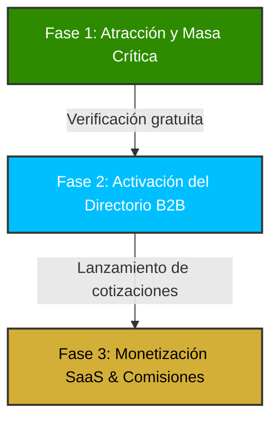

# Modelo de Negocio e Informe de Monetización: KhipuNet

Este documento presenta una propuesta estructurada para la sostenibilidad, operación comercial y monetización de **KhipuNet**, transformándola de un mapa informativo a un **Marketplace de Transferencia Tecnológica B2B**.

---

## 1. La Propuesta de Valor (Value Proposition)

KhipuNet ofrece una triple propuesta de valor diseñada para los tres actores clave del ecosistema ("La Triple Hélice"):

| Actor | Problema que Resuelve | Propuesta de Valor de KhipuNet |
| :--- | :--- | :--- |
| **Empresas (Industria)** | Dificultad para encontrar laboratorios, CITEs o investigadores que resuelvan desafíos tecnológicos específicos. | Un buscador unificado con filtros IVAI 2025 para contratar servicios tecnológicos validados en menos de 5 minutos. |
| **Academia / CITEs** | Poca visibilidad comercial de sus patentes, laboratorios y capacidad de consultoría tecnológica. | Vitrina comercial optimizada (SEO y analíticas de visitas) para captar clientes del sector privado y generar ingresos propios. |
| **Gobierno (CONCYTEC / PRODUCE)** | Falta de datos consolidados para medir el retorno de inversión en innovación y fondos concursos. | Panel de analítica topológica en tiempo real que identifica vacíos en la oferta tecnológica regional y nacional. |

---

## 2. Modelos de Monetización (Revenue Streams)

Para garantizar la viabilidad y rentabilidad, se propone un modelo híbrido basado en cuatro pilares de ingresos:

### A. SaaS Freemium para Proveedores de Innovación (CITEs, OTTs, Startups)
*   **Plan Básico (Gratuito):** Registro en el mapa, visualización en el directorio, datos de contacto genéricos.
*   **Plan Premium (SaaS - $29 a $79 USD/mes):**
    *   **Portafolio de Soluciones:** Subir catálogos detallados de servicios con precios y tiempos de entrega.
    *   **Botón de Cotización Directa:** Leads de empresas interesadas enviados directamente a su bandeja de entrada.
    *   **Medallas de Verificación:** Insignias de confianza otorgadas por KhipuNet que mejoran el posicionamiento en las búsquedas.
    *   **Dashboard de Analíticas:** Ver cuántas empresas han buscado e inspeccionado su ficha técnica.

### B. Comisión por Matchmaking (Brokerage Fee)
*   **Modelo:** KhipuNet actúa como intermediario confiable en el cierre de contratos de transferencia tecnológica, licenciamiento de patentes o consultorías complejas surgidos a través de la plataforma.
*   **Mecanismo:** Cobro de un porcentaje de éxito (comisión del **3% al 7%**) sobre el valor total del contrato de transferencia tecnológica, garantizando la seguridad en el proceso de contratación.

### C. Portales de Innovación Abierta Corporativos (Enterprise SaaS)
*   **Modelo:** Venta de licencias "Marca Blanca" de KhipuNet para grandes empresas traccionadoras (ej. mineras, agroexportadoras).
*   **Funcionalidad:** Un portal privado de KhipuNet donde la corporación publica sus "Desafíos Tecnológicos" y el motor de la plataforma le empareja automáticamente con los CITEs o universidades del mapa que cuentan con las capacidades específicas para resolverlos.

### D. Suscripción de Datos y Reportes Ecosistémicos (Data as a Service - DaaS)
*   **Destinatarios:** Fondos de inversión de capital de riesgo (Venture Capital), bancos de desarrollo (BID, Banco Mundial) y gobiernos regionales.
*   **Monetización:** Venta de reportes de inteligencia comercial sobre la madurez tecnológica por regiones y acceso a la API para integrar el directorio con otros sistemas estatales.

---

## 3. Plan de Operación Comercial (Go-To-Market)

Para escalar la plataforma comercialmente de forma sostenible, se plantea una estrategia dividida en tres fases:

### Fase 1: Atracción de Nodos y Masa Crítica (Mes 1 - 3)
*   **Objetivo:** Integrar al 90% de los CITEs públicos y privados del Perú y a las principales Oficinas de Transferencia Tecnológica (OTT) universitarias.
*   **Estrategia:** Alianzas con PRODUCE e INDECOPI para validar y precargar la información de manera gratuita. KhipuNet se presenta como el "directorio oficial e interactivo del ecosistema".

### Fase 2: Activación del Directorio B2B (Mes 4 - 6)
*   **Objetivo:** Atraer a las primeras 500 PYMEs y empresas compradoras.
*   **Estrategia:** Campaña de marketing enfocada en las cadenas prioritarias de las IVAI 2025. Talleres virtuales sobre *"Cómo deducir impuestos (Ley 30309) contratando laboratorios locales mediante KhipuNet"*.

### Fase 3: Lanzamiento del SaaS y Comisión (Mes 7+)
*   **Objetivo:** Iniciar la facturación recurrente.
*   **Estrategia:** Bloqueo de características avanzadas (cotizador en un clic, portafolio multimedia) y habilitación del servicio de consultores de matchmaking para contratos de alta tecnología.

---

## 4. Estructura de Costos de la Operación

Gracias a la arquitectura tecnológica elegida, los costos fijos de desarrollo son extremadamente bajos en comparación con el software tradicional:

1.  **Tecnología (Servidores y Licencias):**
    *   *Hosting e Infraestructura:* Supabase (Base de datos) y Vercel (Frontend CDN). Costo estimado inicial: **$25 a $50 USD/mes**.
    *   *Mapas:* Google Maps API (gratuito hasta 28,000 cargas mensuales, Leaflet ilimitado gratis).
2.  **Operación y Curaduría:**
    *   *Validador de Datos:* Personal a tiempo parcial encargado de verificar que los nuevos registros correspondan a instituciones reales y clasificar sus capacidades adecuadamente en la base de datos (Curador).
3.  **Ventas y Marketing:**
    *   Comisiones para representantes comerciales que presenten la plataforma Marca Blanca a corporaciones mineras o agrícolas.

---

## 5. Próximos Pasos para el Lanzamiento Comercial
1.  **Crear el Formulario Premium:** Integrar en el formulario de la base de datos actual la opción de cotizar servicios.
2.  **Dashboard de Métricas para Actores:** Desarrollar en el panel del administrador (`/admin`) estadísticas básicas de visualización por nodo para demostrar el valor a las universidades antes de cobrarles por el Plan Premium.
